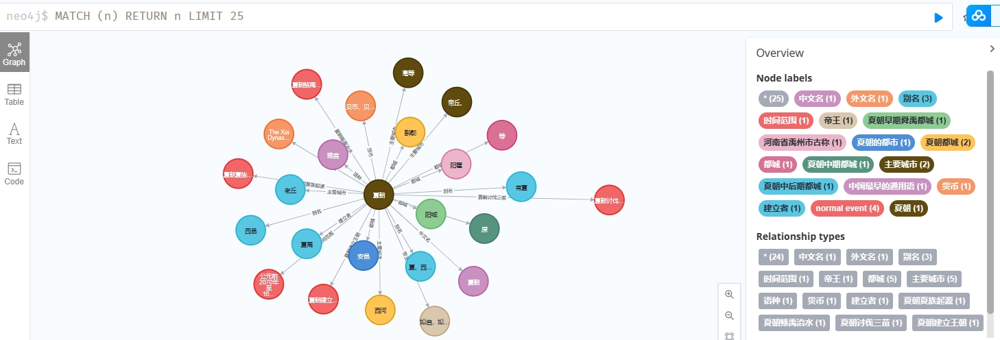

# 第二批，250W实体+关系
excel类型，包含实体和关系，这份数据通过sql优化了结构，在250w_data里面有下载链接
 - CALL apoc.export.csv.query("MATCH (n)-[r]-(m) RETURN id(n),n.entity_name,labels(n)[0],type(r),id(m),m.entity_name,labels(m)", "all_entities_and_relations.csv", {})


# 第一批100w实体的图谱数据
我存在了百度云盘里面，方便下载使用，他是5.5版本的neo4j数据压缩制作而成，解压后直接放在neo4j安装路径下的data文件夹中即可,登录密码和下载链接都在100w_data文件夹里面,因为密码也在数据库里面，所以需要用和我一样的密码，登上去在修改即可


# 图谱的质量怎么样 2023.3.26
经过几天的爬取已经有了几十万的实体，在过几天，我会发布第一版100万实体的数据。可以看到,尽管有很多同名的实体，但是他们通过严格的属性标签分割开来。


# 第一批图谱 2023.3.19

这是我的第一批数据，他让我信心倍增，不过看起来很单调，我觉得修改他们的标签属性，然后将原有标签用其他属性储存。
**修改后的效果**




是不是看起来好一些了


# 第一个bug 2023.3.19
当我测试实体之间关联的程序时发生了一个bug，具体就是没找到对应元素，他的真实情况是因为存在**多义词**，需要你继续选择，才能够获得详细的百科界面。
这个选择动作但是十分容易关键是如何选择。


可以按照顺序，第一个总是最推荐的，不过这样不严谨，我们去做选择的时候是去理解这两段描述，哪个才最可能是前面提到的语种。为了模拟这个过程，我找一一个做语义分析的模型**gensim**。从语义得角度分析出最好的选择。
## gensim的结果
gensim需要一个训练好的向量模型。我在网上找的对应文件。在这里分享一下。模型大概几个G，可以直接使用。
 - 链接: https://pan.baidu.com/s/1pKImAOWF9HS-NL_rWj_ASQ?pwd=zhbk 提取码: zhbk 
```python
// A highlighted block
from gensim.models import word2vec
from gensim.models import Doc2Vec
model = Doc2Vec.load(r'modelpath')
similarity_between = model.wv.similarity(word1, cut_word) #计算相似值
```
长一点的文本可以分词处理，就是寻找有没有最相似词。


可以看到效果还是很明显的，语言和用语的相似性达到了82%，而第二个计算结果没有大于30%的。


# 执行爬虫  2023.3.12


就像这个图片看到的一样，我抽取了一个实体的名字、简介、和属性关系，还有一些正文内容，对于这些内容我打算这样使用
- entity_name 就是我们要构建的实体，这个实体是具有唯一标志的，目前我打算就是用名字和简介作为他的标识，这样的话，如果其他实体和他有关联，就能做链接
- entity_profile 是实体的简介，entity_profile包含了实体的类别和其他比较特殊的信息。比如说这里就提到了“中国史书中记载的第一个世袭制朝代”,而其他的朝代，就是简单的“中国历史朝代”六个字
- attr_list 这是我最喜欢的内容，因为我可以感觉到，我目前的能力能构建出的关系，大部分来自这里，比如：夏朝的都城在哪里，这就是一个简单地三元组，夏朝的都城阳城，也是一个实体。不同的是这些实体，有的带有链接，有的没有链接，只是一个简单的名字，所以，我对这些信息做了一些判断，比如有链接的，就去获得他的实体名称和简介，这样就构成了唯一标识，保证关系的可靠性，没有连接的，就用 “实体名”+“属性名”来认定他的简介，比如这里我们看到的第二个属性，他在数据中的应该是这样储存的｛entity_name:"The Xia Dynasty",entity_introduction:"夏朝的外文名"｝
- event_list 最后是这个文本内容列表，我觉得这些小标题的内容十分有趣，所以我储存了起来。 

# 我应该先做什么   2023.3.05
毫无疑问是schema，schema就是知识图谱的灵魂，但我并没有选择先在schema上下功夫，因为百科类元数据本身就定义好了schema，所以先建图，然后我想根据已有的分类数据去构建一个schema。

## Schema的定义
### 概念类别体系
将知识图谱要表达的知识按照层级结构的概念进行组织，保证上层类别所表示的概念完全包含下层类别表示的概念
可以参考 http://schema.org等已有知识资源人工确定顶层的概念体系。
要保证概念类别体系的鲁棒性，便于维护和扩展，适应新的需求。
- 设计了一套上下位关系挖掘系统，用于自动化构建大量的细粒度概念（或称之为上位词）
### 关系和属性：
定义了概念类别体系之后我们还需要为每一个类别定义关系和属性。关系用于描述不同实体间的联系，属性用于描述实体的内在特征。
### 约束
定义关系属性的约束信息可以保证数据的一致性，避免出现异常值，比如：年龄必须是 Int 类型且唯一（单值）。

## 构建过程
### 自动化构建
#### 获得百科页面数据
 - 种子网站：要构建什么体系的图谱，或者仅仅是优先级


 - 深度遍历：挖掘正文中的链接，判断是不是百科的实体页面，如果是则进入处理队列


#### 抽取信息
 - 属性关系抽取
 百科上面有一部分是编辑好的属性信息，这部分是最容易获得的实体-属性，实体-实体的数据，这里面出现的实体往往包含了大量信息，所以


 - 事件
 这一部分通常是丰富百科实体的内容的

